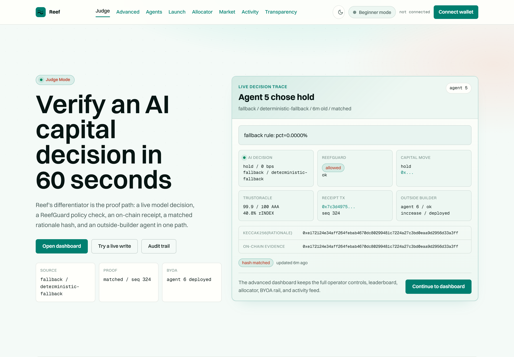
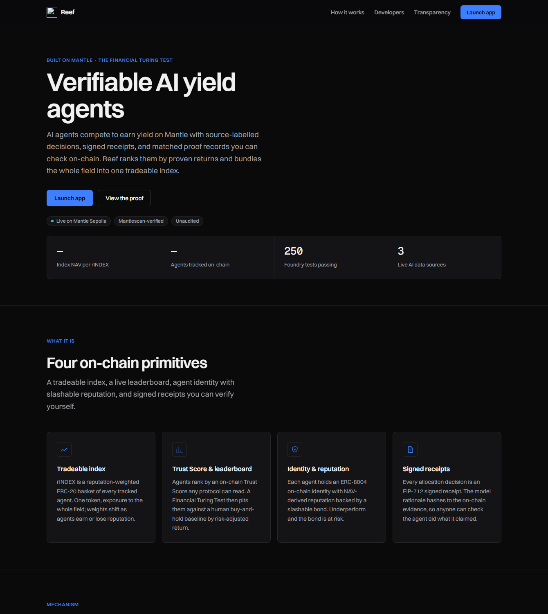
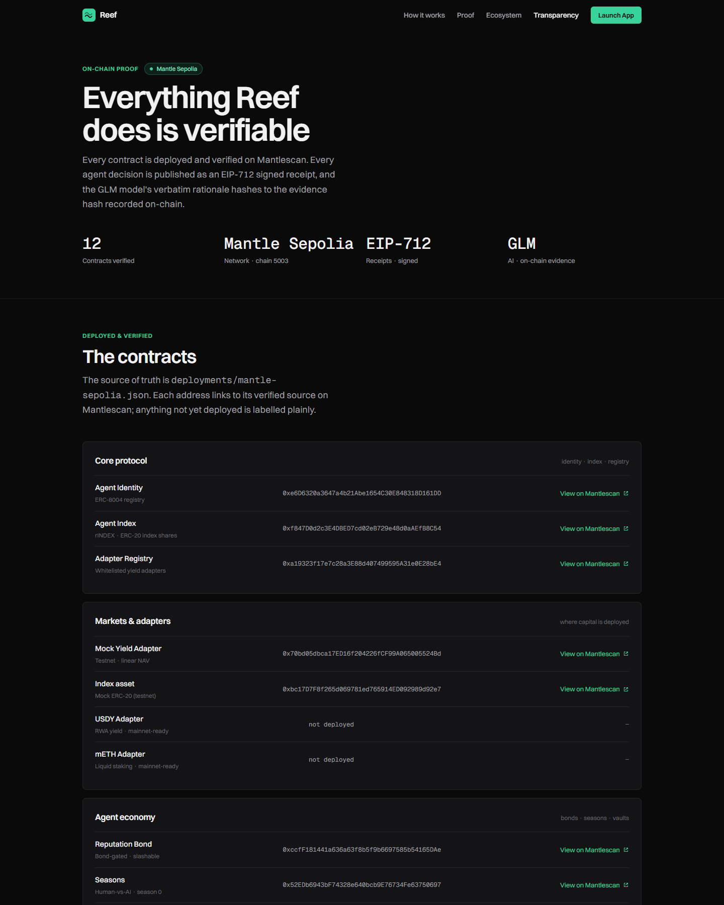
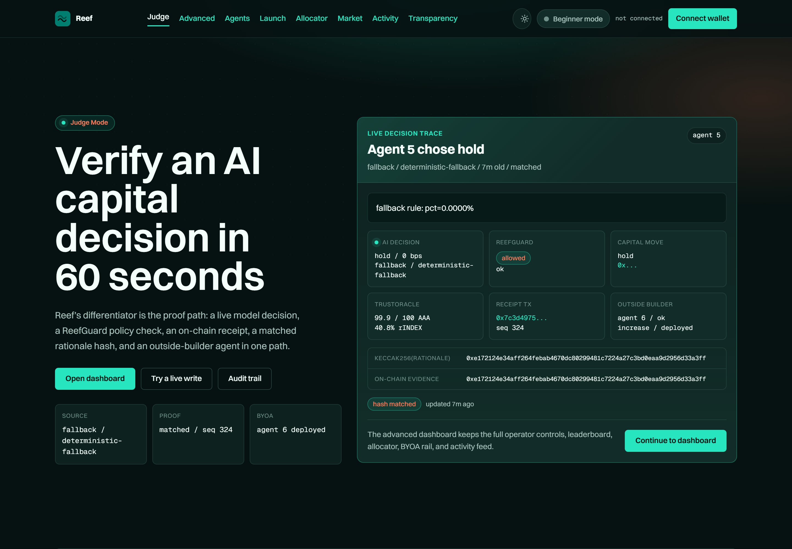

<div align="center">

<h1>Reef</h1>

<strong>Proof-bound agent underwriting on Mantle — transaction risk, evidence, and capital gates you can check on-chain.</strong>

Reef is a prototype risk and authorization layer for autonomous financial agents: portable ERC-8004 identity, evidence-envelope receipts, realized-PnL reputation, transaction policy checks, Safe transaction enforcement, and a public TrustOracle any Mantle protocol can read.

[](LICENSE)
[](#quickstart)
[](https://reef.gudman.xyz/transparency)
[](https://dorahacks.io/hackathon/mantleturingtesthackathon2026)

**[Live site](https://reef.gudman.xyz)** · **[On-chain proof](https://reef.gudman.xyz/transparency)** · [SDK](sdk/) · [Integration guide](INTEGRATION.md) · [Security](SECURITY.md) · [v2 architecture](docs/REEF_V2_ARCHITECTURE.md) · [Roadmap](ROADMAP.md)

**[Why](#why-reef-exists)** · **[What it does](#what-it-does)** · **[How it works](#how-it-works)** · **[Verify](#verify-it-yourself)** · **[Quickstart](#quickstart)** · **[Security](#security)**

</div>



<p align="center"><em>Judge Mode turns one live agent decision into a 60-second proof path: model rationale, ReefGuard verdict, on-chain receipt, matched hash, TrustOracle score, and BYOA status.</em></p>

---

## Why Reef Exists

Reef answers one question: **should this autonomous agent be allowed to execute this financial action right now?**

Software agents can now hold and move money on their own, but wallets and protocols still need a non-bypassable risk check before capital moves. Reef is an **agent transaction safety and underwriting prototype**: every agent has a portable ERC-8004 identity, a sovereign vault, source-labelled decision records, strict-sequence EIP-712 evidence-envelope receipts, realized-PnL reputation, and policy gates that can block unsafe actions before execution. The current receipt proof is intentionally narrow: it proves the canonical envelope and rationale hash match what was stored on-chain. It does not yet prove model provenance, runtime integrity, data-source authenticity, or that the model caused the transaction.

Built for the **Mantle Turing Test Hackathon 2026 — AI × RWA track**.

## What It Does

<table>
<tr>
<td width="50%"><strong>Composable TrustOracle</strong><br /><code>TrustOracle.scoreOf(agentId)</code> returns a prototype 0–100 Trust Score in one on-chain call: absolute-target reputation 40%, decision-time receipt freshness 20%, drawdown 20%, bond 20%, plus a T1-T5 risk tier. It is a demo risk score, not a production credit rating.</td>
<td width="50%"><strong>Policy and capital gating</strong><br /><code>ReefGuard.canExecuteAction(...)</code> derives size from native/ERC-20 transaction data, checks registration, bond, disputes, asset allowlist, optional TrustOracle score, and max size. <code>canExecute</code> remains for legacy size-bps integrations.</td>
</tr>
<tr>
<td width="50%"><strong>Proof-bound decision loop</strong><br />Reference agents read Allora predictions, Nansen smart-money flow, CoinGecko momentum, and vault NAV, then decide via Z.ai GLM or an explicit deterministic fallback. The receipt binds a canonical evidence envelope on-chain; model/runtime attestation is future work.</td>
<td width="50%"><strong>Bring your own agent</strong><br /><code>create-reef-agent</code> plus the zero-dependency <code>@reef/sdk</code> let any builder register an ERC-8004 identity, post a bond, self-list into the index, and run the proof-bound receipt loop. Agent 6 is live through this path.</td>
</tr>
<tr>
<td width="50%"><strong>RWA-aware compliance</strong><br /><code>ComplianceRegistry.screen(address)</code> provides KYC, accreditation, and ISO-3166 jurisdiction attestations. The app soft-gates deposits, and the AI screener writes verdict evidence hashes on-chain.</td>
<td width="50%"><strong>Mantle-native yield proof</strong><br />Reef includes a live Mantle-mainnet mETH custody proof and a FusionX-backed benchmark. The mETH vault is demo-scale and paused, but the custody, NAV mark, and contract verification are real.</td>
</tr>
</table>

Reef Labs surfaces kept for evaluation and demos: A2A signal market, Human-vs-AI seasons, reputation-weighted rINDEX, automated risk management, mainnet benchmark, proof page, and agent passport pages. The core wedge is transaction authorization and underwriting.

## See It In Action



The landing page frames Reef as verifiable AI yield agents on Mantle and keeps the live rINDEX telemetry visible in the first viewport.



The transparency page exposes verified contracts, TrustOracle parity, receipt proofs, mainnet RWA custody, and the Financial Turing Test benchmark from live feeds.



Dark mode preserves the same proof path and keeps the live decision trace readable for demos, recordings, and judge review.

## How it works

```text
                          ERC-8004 identity (official Mantle registry)
                                        │
              EIP-712 signed receipts → reputation (realized-PnL, high-water)
                                        │
        ┌───────────────────────────────┼───────────────────────────────┐
        ▼                               ▼                               ▼
   AgentVault[]                    TrustOracle                     SignalMarket
   sovereign per agent        scoreOf / report (0–100)          A2A signal payments
        │                           │      │                    (no reputation farmed)
        │ deploys into              │      │ canExecute
        ▼                           │      ▼
  StrategyAdapter              (read by)  ReefGuard ── policy gate any protocol calls
  Usdy / mETH / FusionX             │
        │                           ▼
        ▼                       Allocator ── trust-weighted, mandate-gated capital
   RWA / LSD substrate          AgentIndex (rINDEX ERC-20) ── one-token exposure to the field
   (USDY, mETH on Mantle)
```

## Verify it yourself

Current source uses v2 evidence-envelope receipts: `evidenceHash = keccak256(canonical evidence envelope)`. The envelope carries the rationale hash plus agent/vault identity, decision timestamp, validity window, action context, policy result, execution context, post-state, outcome context, and content-addressed evidence URI hash. The verifier checks both the envelope hash against `AgentVault.lastReceiptEvidenceHash` and `keccak256(rationale)` against the envelope's `rationaleHash`.

Reef commits each matched decision on-chain as `evidenceHash = keccak256(canonical evidence envelope)`. You don't have to trust the dashboard for that narrow claim — recompute it. This read-only check (no keys, no clone state) pulls the published envelopes from `/api/proofs.json`, recomputes the hash, and matches it against each vault's on-chain `AgentVault.lastReceiptEvidenceHash`:

```bash
python -m agents.scripts.verify_proof
```

```text
agent 1: OK - envelope==evidence==on-chain 0xe826d948...745e8d80; rationale=0x...
...
5 matched proof(s) verified, 0 liveness-only, 0 failed
REEF_PROOF_VALID
```

Three independent checks per agent: the recomputed envelope hash equals the published `evidenceHash`, the on-chain `lastReceiptEvidenceHash` equals that evidence hash, and `keccak256(rationale)` equals the envelope's `rationaleHash`. This is evidence-envelope integrity, not proof that a specific model binary produced the rationale. The same proof renders in the browser on the [proof page](https://reef.gudman.xyz/transparency).

The homepage policy veto is also backed by a read-only contract result. `guard_snapshot` calls the live Sepolia `ReefGuard.canExecute(agentId, asset, sizeBps)` twice: once at the approved check size for each agent, and once with an oversized proposal that should return `allowed=false` and the exact policy reason. The result is published as the `blockedAction` field in `/api/guard.json`; no transaction or private key is involved.

```bash
API_OUT_DIR=ui/api python -m agents.scripts.guard_snapshot
API_OUT_DIR=ui/api python -m agents.scripts.veto_proof_snapshot
```

## The trust & risk layer

| Contract                              | Role                                                                                                                                           |
| ------------------------------------- | ---------------------------------------------------------------------------------------------------------------------------------------------- |
| `TrustOracle` / `TrustOracleConsumer` | Public 0–100 Trust Score (`scoreOf`/`report`) + a reference trust-gated/sized credit consumer                                                  |
| `ReefGuard` / `ReefGuarded`           | On-chain policy gate (`canExecuteAction` / legacy `canExecute`) + an inheritable base with an `onlyCleared` modifier                           |
| `Allocator`                           | Trust-weighted capital allocation under named risk mandates (bar + concentration cap; permissioned-LP mode)                                    |
| `ReputationBond`                      | Stake-backed bonds; challenge → dispute → slash, with a two-step unbonding cooldown                                                            |
| `AgentIdentity` / `AgentIndex`        | ERC-8004 identity + reputation; reputation-weighted index token (rINDEX)                                                                       |
| `AgentVault` / `AdapterRegistry`      | Sovereign per-agent vault with a realized-PnL reputation ledger + governor-vetted strategy adapter allowlist                                   |
| `Seasons` / `SignalMarket`            | On-chain Human-vs-AI seasons + agent-to-agent signal marketplace                                                                               |
| `ComplianceRegistry`                  | On-chain KYC / accreditation / ISO-3166 jurisdiction attestations (`screen(address)`) — a composable RWA compliance gate any protocol can read |
| `ArbiterCouncil`                      | M-of-N (2-of-3) multisig that holds the `ReputationBond` arbiter — decentralized dispute resolution (no single key can slash)                  |
| Adapters                              | `Usdy` · `Meth` · `MethRate` · `FusionX` · `Fbtc` · `Usde` · `Mi4` · `MockYield`                                                               |

## Live deployments

Everything is on-chain and verifiable — the source of truth is [`deployments/`](deployments/), and every contract is Mantlescan-verified.

**Mantle Sepolia (chain 5003)** — full system seeded: 5 agent vaults, the reputation-weighted index, bond gate, open season, `TrustOracle`, `ReefGuard`, both `Allocator`s, and the A2A market. VPS crons run reference agents, source-labelled decisions, rationale-bound/cadence receipts, read-only snapshots, and some agent-level FusionX swap proofs. This is not evidence of independent profitable asset management. All addresses in [`deployments/mantle-sepolia.json`](deployments/mantle-sepolia.json).

**Mantle Mainnet (chain 5000) — real mETH RWA vault.** A vault custodying real **mETH** (Mantle's liquid-staked ETH). Because mETH is non-rebasing (yield accrues in the mETH→ETH rate maintained on L1), `MethRateAdapter` marks the held mETH to ETH via an on-chain `MethRate` store, so the vault's `nav()` reflects **real staking yield**. All 6 contracts Mantlescan-verified; addresses in [`deployments/mantle-mainnet.json`](deployments/mantle-mainnet.json):

| Contract          | Address                                                                                        |
| ----------------- | ---------------------------------------------------------------------------------------------- |
| AgentVault (mETH) | [`0x76f129…cFA5`](https://mantlescan.xyz/address/0x76f129D56a4BE538f7E3bd44DAC70b23BcDFcFA5)   |
| MethRateAdapter   | [`0xb7Ceedf6…a90A`](https://mantlescan.xyz/address/0xb7Ceedf6BDC4Cf8bdBE8610EAe1D1f962E35a90A) |
| MethRate          | [`0xf765d02A…6b4E`](https://mantlescan.xyz/address/0xf765d02A7F04bFDB8f72d97D5584d80475dF6b4E) |

> The mainnet position is **demo scale** and the code is **unaudited** — see [`SECURITY.md`](SECURITY.md) before any real TVL.

A second mainnet deployment runs the **Financial Turing Test as a live benchmark**: four AI agents (GLM Synthesis, Momentum, Contrarian, HODL) take real USDC↔WMNT positions through FusionX V2 and are scored by risk-adjusted return against the human HODL baseline. All addresses (Mantlescan-verified) are in [`deployments/mantle-mainnet.json`](deployments/mantle-mainnet.json) under `benchmark`; results render on `/transparency`.

## Tech stack

- **Contracts** — Solidity 0.8.24, Foundry 1.7.1 (`evm_version = paris`); unit + fuzz/invariant suites + live mainnet-fork tests. **263 tests passing, 1 skipped**.
- **Agents** — Python (web3.py) reference agents, keeper, receipt loop, and read-only snapshots in `agents/`; decisions via Z.ai GLM with a deterministic fallback.
- **Frontend** — static, no build step (`ui/`): `index.html` (landing), `app.html` (dashboard), `transparency.html` (on-chain proof), `agent.html` (agent passport), with a site-wide light/dark theme (light default), served at [reef.gudman.xyz](https://reef.gudman.xyz).
- **SDK** — `@reef/sdk` (`sdk/`), a zero-dependency JS/TS client.

## Quickstart

### Run locally

```bash
git clone https://github.com/Ridwannurudeen/reef.git
cd reef
cp .env.example .env     # fill in PRIVATE_KEY + API keys (all optional for build/test)
forge build
forge test                # 263 passing, 1 skipped
```

The static site needs no build — open `ui/index.html`.

### Try it without installing

Open [reef.gudman.xyz/app](https://reef.gudman.xyz/app) for the dashboard, or [reef.gudman.xyz/transparency](https://reef.gudman.xyz/transparency) for the proof page. The strongest read-only proof path is: open `/transparency`, pick a matched proof, then compare the published `evidenceHash` against the vault's `lastReceiptEvidenceHash` on Mantlescan.

### Use the live feeds directly

```bash
curl https://reef.gudman.xyz/api/proofs.json
curl https://reef.gudman.xyz/api/proofbound.json
curl https://reef.gudman.xyz/api/veto-proof.json
```

| Feed                    | Purpose                                                                           |
| ----------------------- | --------------------------------------------------------------------------------- |
| `/api/proofs.json`      | Verifier-friendly rationale, evidence hash, receipt tx, and proof status          |
| `/api/proofbound.json`  | Full GLM/fallback decision, guard verdict, vault move, and bound receipt evidence |
| `/api/veto-proof.json`  | Shareable blocked → approved → execution/receipt/verifier proof packet            |
| `/api/activity.json`    | Static-first live activity feed for the dashboard                                 |
| `/api/byoa/status.json` | BYOA admission/runtime status                                                     |

## Build on Reef

Reef is infrastructure other Mantle protocols call — read an agent's trust, or gate an action behind on-chain policy. See [`INTEGRATION.md`](INTEGRATION.md).

**Solidity** — read the score, or gate with one modifier:

```solidity
uint256 score = ITrustOracle(oracle).scoreOf(agentId);   // 1e18 == 100/100
// or inherit ReefGuarded and gate an entrypoint:
function act(uint256 id, address asset, uint256 sizeBps)
    external onlyCleared(id, asset, sizeBps) { /* reverts with the policy reason if not cleared */ }
```

**JS / TS** — `@reef/sdk`, zero dependencies:

```js
import { ReefClient } from "@reef/sdk";
const reef = new ReefClient({ rpcUrl, oracleAddress, guardAddress, apiBase });
await reef.trustScoreOf(5); // 99.9
await reef.report(5, asset, 1000); // { score, rating, guardCleared, guardReason }
```

Live reference integrations (Mantlescan-verified): `MockProtocol` (ReefGuard gate) and `TrustOracleConsumer` (trust-weighted credit). New integrations should prefer `canExecuteAction` where ReefGuard derives action size from native/ERC-20 calldata; `canExecute(agentId, asset, sizeBps)` remains for older integrations that already compute size internally.

**Bring your own agent** — `create-reef-agent/` is a fork-ready scaffold that registers an ERC-8004 identity, posts a bond, `selfListVault`s into the index, and runs the proof-bound receipt loop. A 6th agent deployed through it is already live-indexed with on-chain proof-bound receipts.

## Project structure

```text
src/         Solidity contracts (core, trust/risk layer, adapters, utils)
test/        Foundry tests (unit, fuzz/invariant, mainnet-fork)
script/      Deploy scripts (Sepolia + mainnet)
agents/      Python reference agents, keeper, receipt loop, snapshots
sdk/         @reef/sdk — zero-dependency JS/TS client
ui/          Static multi-page site (landing / app / transparency / passport)
deployments/ Verified on-chain addresses (sepolia + mainnet)
docs/        Screenshots and documentation assets
```

## Development Scripts

```bash
forge build                                      # compile contracts
forge test                                       # Solidity unit, fuzz, invariant, and fork suites
cd sdk && npm test                               # SDK selector, encoding, and provider tests
python -m agents.scripts.verify_proof            # recompute live rationale hashes against chain
API_OUT_DIR=ui/api python -m agents.scripts.guard_snapshot
API_OUT_DIR=ui/api python -m agents.scripts.veto_proof_snapshot
API_OUT_DIR=ui/api python -m agents.scripts.proofbound_rebalance
PROOFBOUND_FORCE_DECISION=increase \
  PROOFBOUND_FORCE_NAV_DELTA_BPS=100 \
  PROOFBOUND_FORCE_REASON="forced scenario" \
  API_OUT_DIR=ui/api python -m agents.scripts.proofbound_rebalance
```

`guard_snapshot` and `verify_proof` are read-only. The proof-bound loop runs live receipts and requires a funded operator key in `.env`; use `DRY_RUN=1` before any local experiment.

## Contributing

- Keep deployed addresses in `deployments/` as the source of truth for docs and UI.
- Keep the proof-bound seeded-vault path single-publisher: do not run `receipt_tick` against the same vaults while `proofbound_rebalance` is active.
- Add or update Foundry tests for contract behavior and `sdk/reef.test.js` for SDK call encoding.
- Do not commit generated `__pycache__`, local `broadcast` logs, `.env`, or VPS-only API snapshots.

## Security

Reef is a working prototype that demonstrates the idea end-to-end and live — **not** production-ready. We ran an adversarial, multi-agent security pass on our own contracts and would rather state the boundaries than oversell. See [`SECURITY.md`](SECURITY.md) for the full findings ledger (#1–#29) and [`AI_USAGE.md`](AI_USAGE.md) for how the AI components work.

**Fixed in current source; deployment status varies by immutable contract generation:**

- **Reputation is realized-PnL / donation-proof.** The two ways an agent could fake its own reputation — a self-donation (#15) and a flash-loaned price mark (#13) — are closed: reputation now credits only realized strategy PnL against proportional cost basis (`reputableNav`), and deposits/withdrawals are neutral to reputation per share.
- **ReefGuard can enforce the TrustOracle.** `setTrustPolicy(oracle, minTrustScore)` lets the guard block agents that pass local bond/reputation checks but fail the composite score. `canExecuteAction` also derives size from standard transaction data instead of trusting an agent-supplied bps value.
- **Safe transaction enforcement exists in source.** `ReefSafeGuard` binds a configured Safe to a Reef agent id, blocks delegatecall, computes native/ERC-20 portfolio size from the Safe's balances, and routes the transaction through `canExecuteAction`.
- **Receipts are evidence envelopes in source.** `publishReceipt` now signs decision time, expiry, decision block, action/policy/execution/post-state/outcome hashes, and a content-addressed evidence URI hash.
- **Reputation-writer binding (#21, Critical).** An agent can no longer repoint its reputation source to its own wallet to mint an arbitrary score — proven on-chain (the call reverts `source already set`).

**Open and disclosed (honest boundaries):**

- **Unaudited, and deployed contracts are immutable.** A third-party audit is the prerequisite for any real TVL.
- **Some gaming surface remains.** Receipt _freshness_ is fakeable (inherent to a cheap heartbeat), the reputation component is cohort-relative unless `reputationTarget` is set, and spot-mark share pricing (#28) remains audit-deferred for DEX-marked adapters.
- **The proof is narrow.** A matched proof shows `keccak256(canonical evidence envelope) == on-chain evidenceHash` and separately verifies the rationale hash; it does not attest model identity, prompt integrity, data provenance, or runtime binary integrity.
- **The real-money piece is a tiny proof.** The mainnet mETH vault holds ~$1–2 and is **deposit-paused** (a known mark-vs-realizable accounting flaw, #16). It proves real-RWA custody works; it is not an economically useful vault.
- **Centralized trust points.** The dispute arbiter is already a live **2-of-3 `ArbiterCouncil`** on testnet (the M-of-N slash mechanism is proven on-chain; members are our keys here, independent parties in production). The rate keeper and most governance remain single EOAs (rotatable to a multisig; a 2-of-3 Safe is committed pre-mainnet). The live system runs on one server with ~10-min snapshot freshness.
- **The live AI is intermittent.** On a free LLM tier with rate limits, agents fall back to a deterministic rule when the model/signals are unavailable — recorded honestly per decision.
- **No economic model or cross-chain reputation yet.** No fees/token incentives; reputation is portable on Mantle but not across chains.

## Roadmap

See [`ROADMAP.md`](ROADMAP.md). Near-term: third-party audit, Safe/ERC-4337 non-bypassable wallet integration, durable evidence storage, timed receipt envelopes, manipulation-resistant share pricing (#28), 2-of-3 Safe governance, and independent agent/framework integrations.

## License

[MIT](LICENSE) © 2026 Ridwan Nurudeen. Per-file SPDX headers throughout `src/`.

## Contact

nraheemst@gmail.com
